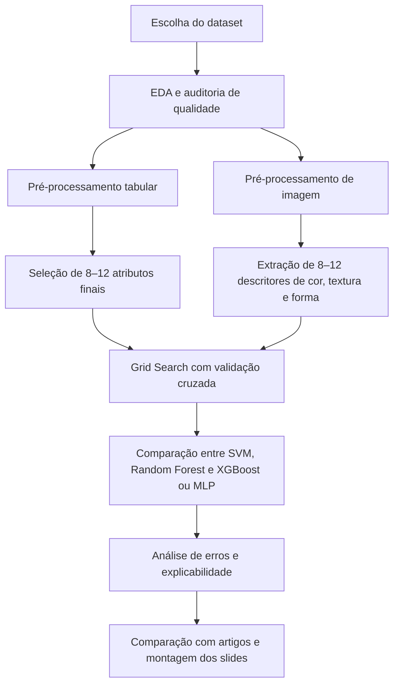

# Plano completo para o trabalho acadêmico sobre Agronegócio com previsão de safra e detecção de doenças em plantas

## Resumo executivo

O enunciado do trabalho exige, na prática, um miniestudo de ciência de dados completo: escolha de base(s), limpeza e pré-processamento, seleção de **8 a 12 atributos finais**, treinamento de **três modelos**, ajuste com **Grid Search**, validação com **k-fold**, comparação com um **artigo de referência**, e apresentação dos resultados em formato acadêmico. Isso está alinhado com a estrutura que proponho abaixo. fileciteturn0file0

Se a sua dúvida central é **“qual subtema tem mais material?”**, a resposta é: **detecção de doenças em plantas**. Esse subtema tem mais benchmarks públicos, mais competições no Kaggle, mais artigos de visão computacional e resultados muito fáceis de comparar entre si, especialmente com PlantVillage, Plant Pathology 2020, Cassava e PlantDoc. citeturn58view0turn36view0turn39view3turn41view0

Se a sua dúvida central é **“qual subtema é mais fácil de executar dentro do que o professor pediu?”**, a resposta é: **previsão de safra em dados tabulares**. Ela se encaixa melhor na exigência de trabalhar com 8–12 variáveis finais, explicar seleção de atributos, treinar SVM/Árvore/Random Forest/XGBoost e aplicar validação cruzada sem a complexidade extra de pipeline de imagens. fileciteturn0file0

Minha recomendação objetiva é esta: **faça previsão de safra como eixo principal do trabalho** e use **detecção de doenças em plantas como segundo estudo ou extensão visual**. Se o grupo precisar escolher apenas um caminho, o melhor custo-benefício acadêmico é **previsão de safra com dados oficiais**; se houver tempo para um segundo experimento, adicione **classificação de doenças** para enriquecer os slides e a discussão. citeturn53view0turn52view0turn45view0turn58view0

## Escolha recomendada para cumprir bem o trabalho

Para um trabalho acadêmico com boa chance de fechar todos os itens do enunciado, há dois caminhos fortes.

O caminho **mais seguro** é usar um painel tabular de previsão de safra. Ele permite justificar claramente as variáveis, mostrar EDA, tratar missing/outliers, fazer feature engineering, rodar SVM/Random Forest/XGBoost e explicar métricas como RMSE, MAE e R² com facilidade. Bases oficiais como **FAOSTAT + Climate Change Knowledge Portal** e **IBGE PAM + INMET/METBRA25Y** são especialmente fortes porque dão respaldo metodológico e originalidade. citeturn45view0turn46search1turn53view0turn52view0

O caminho **mais rico em literatura e mais visual** é a detecção de doenças. Aqui o volume de material público é excelente, mas, para cumprir a parte de “8–12 atributos finais”, o ideal é não depender só de CNN ponta a ponta. Em vez disso, você pode extrair descritores de cor, textura e forma da folha, montar uma base tabular com 8–12 atributos e então treinar SVM, Random Forest e XGBoost/MLP. Isso atende melhor ao espírito do trabalho do que simplesmente jogar imagens em uma rede pré-treinada. citeturn36view0turn58view0turn32view0turn32view1

Em resumo, a decisão final fica assim:

| Critério | Melhor opção |
|---|---|
| Mais material bibliográfico e benchmarks | Detecção de doenças em plantas |
| Mais fácil de executar dentro do enunciado | Previsão de safra |
| Melhor base oficial para regressão | FAOSTAT + CCKP ou IBGE PAM + METBRA25Y |
| Melhor base prática para classificação | Plant Pathology 2020 ou Cassava Leaf Disease Classification |
| Melhor “combo” para nota e apresentação | Previsão de safra como projeto principal + doenças como extensão |

Essa recomendação se apoia no fato de que PlantVillage e seus derivados têm enorme volume de estudos, enquanto bases de produtividade agrícola em formato tabular são mais fáceis de transformar em um pipeline acadêmico completo e explicável. citeturn58view0turn36view0turn39view3turn41view0turn53view0turn42view0

## Datasets prioritários para previsão de safra

Abaixo estão os **três datasets prioritários** que eu realmente recomendaria para regressão.

| Dataset | Origem e link | Tamanho e escala | Variáveis disponíveis | Qualidade dos dados | Tipo e alvo sugerido | Justificativa de adequação |
|---|---|---|---|---|---|---|
| **FAOSTAT + World Bank Climate Change Knowledge Portal** | Base oficial FAO + portal climático do Banco Mundial. A FAOSTAT é a principal base estatística de agroalimentos da FAO; o CCKP fornece dados climáticos agregados e API. citeturn46search1turn45view0 | Série histórica global desde 1961 na FAOSTAT; o CCKP trabalha com agregações por país/subnacional. Um estudo usando essas fontes trabalhou com dados de 1960–2021 e observou que a série de inseticidas limita parte da janela temporal. citeturn46search1turn42view0 | País, código ISO3, ano, item/cultura, precipitação, temperatura, HDD/CDD, inseticidas, quantidade e rendimento. citeturn42view0turn45view0 | A qualidade é boa por ser oficial, mas há **incompatibilidade de cobertura temporal** entre variáveis, especialmente inseticidas; o próprio estudo relata necessidade de limpeza, VIF e organização das séries antes da modelagem. citeturn42view0 | **Regressão**. Alvo principal: `yield (hg/ha)` ou equivalente. | Melhor opção para um trabalho com base oficial, comparável com literatura e facilmente justificável metodologicamente. citeturn33academia1turn42view0 |
| **IBGE PAM tabela 1612 + METBRA25Y / INMET** | PAM do IBGE para produção agrícola municipal + arquivo meteorológico harmonizado derivado de dados públicos do INMET. citeturn53view0turn52view0 | A PAM cobre o Brasil inteiro, é anual e tem série histórica de 1974–2024; a própria SIDRA aceita downloads imediatos até 200 mil valores e a posteriori até 3 milhões. O METBRA25Y cobre 2000–2025, com 616 códigos de estação. citeturn53view0turn44view1turn52view0 | Quantidade produzida, área plantada, área colhida, rendimento médio, valor da produção, município, UF, ano; no METBRA25Y há precipitação, temperatura, umidade, pressão, vento e radiação solar em resolução horária. citeturn53view0turn52view0 | Excelente para análise séria, mas exige atenção aos códigos do SIDRA: `...` para indisponível, `X` para inibido, mudanças de unidade ao longo da série, e diferentes semânticas para culturas de longa duração; o METBRA25Y já converte valores fisicamente implausíveis em missing e adiciona flags de qualidade e auditorias de missing. citeturn53view0turn52view0 | **Regressão**. Alvo principal: `rendimento médio (kg/ha)` para soja, milho, mandioca, cana ou outra cultura. | É a opção mais original e mais “forte” para banca brasileira, porque usa dados oficiais do Brasil e permite discutir clima, produtividade e sazonalidade com contexto nacional. citeturn53view0turn52view0 |
| **Kaggle Crop Yield Prediction Dataset** | Base pronta no Kaggle com múltiplas culturas, áreas e anos. A página do Kaggle confirma a existência da base; estudos recentes descrevem o conjunto com variáveis climáticas, insumos e rendimento. citeturn13view0turn18view0 | Porte pequeno a médio, em formato CSV pronto para uso. O material técnico consultado descreve a base como multicultura, multirregião e multianual, cobrindo 1990–2013. O número exato de linhas não aparece no HTML público parseado da página do Kaggle e deve ser confirmado após download. citeturn18view0turn16view0 | `Area`, `Item`, `Year`, `average_rain_fall_mm_per_year`, `pesticides_tonnes`, `avg_temp`, `hg/ha_yield`. citeturn18view0 | É a opção mais rápida, mas a página pública parseada não expõe estatística detalhada de missing; o artigo associado mostra matriz de correlação e boxplot, então vale auditar duplicatas e outliers localmente logo após baixar. citeturn18view0 | **Regressão**. Alvo principal: `hg/ha_yield`. | Melhor base para terminar rápido e comparar com artigos muito próximos do seu pipeline. citeturn16view0turn18view0 |

Se eu tivesse de **escolher uma única base de regressão hoje**, eu faria assim: **IBGE PAM + METBRA25Y** se o professor valoriza originalidade e contexto brasileiro; **FAOSTAT + CCKP** se o grupo quer uma base oficial mais internacional e mais próxima de papers comparáveis; **Kaggle Crop Yield Prediction Dataset** se o prazo estiver curto e a prioridade for execução rápida. citeturn53view0turn52view0turn42view0turn18view0

Para cumprir a exigência de **8–12 atributos finais**, eu sugiro as combinações abaixo.

No caso **FAOSTAT + CCKP**, a melhor seleção final é: cultura, país/ISO3, ano, precipitação anual ou da estação de crescimento, temperatura média, anomalia de temperatura, inseticidas por área, área colhida, yield defasado em 1 ano, média móvel de yield em 3 anos e interação temperatura × precipitação. Isso gera um conjunto de 10 ou 11 atributos muito explicáveis e forte para regressão. A própria literatura baseada em FAO e clima trabalha justamente com chuva, temperatura, insumos e rendimento. citeturn42view0turn33academia1

No caso **IBGE PAM + METBRA25Y**, a seleção final mais forte é: cultura, município ou microrregião, ano, área plantada, área colhida, precipitação acumulada da safra, temperatura média da safra, temperatura máxima P90, umidade relativa média, radiação solar acumulada e rendimento médio do ano anterior. Em culturas brasileiras, esse conjunto já atende tanto a lógica agronômica quanto a exigência de 8–12 variáveis. citeturn53view0turn52view0

No caso **Kaggle Crop Yield Prediction Dataset**, eu recomendo enriquecer a base para não ficar “curta demais”: ano normalizado, chuva, temperatura média, temperatura ao quadrado, pesticidas, interação chuva × temperatura, yield defasado por `Area-Item`, e média móvel de yield. Com isso, você sai de um CSV muito básico e monta um trabalho academicamente mais robusto. citeturn18view0

## Datasets prioritários para detecção de doenças em plantas

Abaixo estão os **três datasets prioritários** para classificação.

| Dataset | Origem e link | Tamanho e escala | Variáveis disponíveis | Qualidade dos dados | Tipo e alvo sugerido | Justificativa de adequação |
|---|---|---|---|---|---|---|
| **PlantVillage** | Repositório aberto clássico de saúde de plantas, difundido em artigos e amplamente espelhado em Kaggle e outras plataformas. citeturn58view0 | **54.306 imagens** de folhas saudáveis e doentes; estudo clássico reporta identificação de **14 espécies agrícolas** e **26 doenças/ausência de doença**. citeturn58view0 | Imagens RGB e rótulo de classe espécie-doença. | Quase sem problema de missing no sentido tabular, mas tem a limitação metodológica mais importante: imagens em **condições controladas e fundo homogêneo**, o que facilita demais o problema e piora a generalização para campo. Um modelo treinado ali chegou a 99,35% no hold-out, mas caiu para 31,4% em imagens externas. citeturn58view0turn36view0 | **Classificação multiclasse**. Alvo: rótulo espécie-doença. | Excelente para baseline rápido, reprodução de literatura e experimento inicial. citeturn58view0 |
| **Plant Pathology 2020** | Dataset do desafio do Kaggle do workshop FGVC/CVPR 2020, com imagens reais de folhas de maçã. citeturn39view3turn38view5 | **3.651 imagens RGB** reais de campo; distribuição reportada: 1.200 scab, 1.399 cedar apple rust, 187 complex disease e 865 healthy. citeturn39view3 | Imagens RGB e rótulos de classes foliares. | Muito melhor para cenário real: variação de iluminação, ângulo, superfície e ruído. O ponto fraco é a classe “complex disease”, pequena e difícil; no paper, essa classe ficou com apenas 51% de acerto em um modelo ResNet50, apesar de 97% de accuracy global. citeturn39view3 | **Classificação multiclasse**. Alvo: `healthy`, `rust`, `scab`, `complex`. | Melhor base para um trabalho realista sem ficar grande demais; ótima para comparar com métricas de competição baseadas em AUC. citeturn39view0turn39view3 |
| **Cassava Leaf Disease Classification** | Competição do Kaggle baseada em imagens de folhas de mandioca coletadas em Uganda e anotadas por especialistas. citeturn4view0turn41view0 | Estudo recente em português/inglês reporta **21.367 imagens** em **5 classes**; a base é fortemente desbalanceada, com CMD representando 61,5% e CBB cerca de 5%. citeturn41view0 | Imagens RGB e classe da doença: CBB, CBSD, CMD, CGM e saudável. | Muito boa para um trabalho sério porque é realista e desbalanceada. A literatura sobre cassava também mostra presença de ruído de fundo, diferentes condições de captura e complexidade visual maior do que PlantVillage. citeturn41view0turn35view0 | **Classificação multiclasse**. Alvo: classe da doença. | Melhor opção para discutir balanceamento, macro-F1 e robustez em cenário tropical. citeturn41view0turn35view0 |

Se a prioridade for **executar rápido**, use **PlantVillage**. Se a prioridade for **fazer um trabalho mais convincente para banca**, use **Plant Pathology 2020**. Se a prioridade for **apresentar um problema realista e discutir desbalanceamento com força**, use **Cassava Leaf Disease Classification**. citeturn58view0turn39view3turn41view0

Como “backup” muito forte, especialmente se vocês quiserem um recorte em arroz, o **Paddy Doctor** é excelente: 16.225 imagens, 13 classes, imagens reais de campo, classe normal + 12 doenças, e benchmark com ResNet34 atingindo F1 de 97,50%. citeturn38view1turn38view2

Para atender à exigência de **8–12 atributos finais** em imagens, o melhor caminho é transformar a folha em uma tabela de descritores. A seleção final recomendada, comum aos três datasets, é: média de Hue, desvio padrão de Hue, média de Saturation, excesso de verde, razão de área lesionada, contraste GLCM, homogeneidade GLCM, correlação GLCM, entropia de textura, densidade de bordas e circularidade da folha ou da lesão. Esse conjunto gera 10 ou 11 atributos explicáveis e funciona bem com SVM, Random Forest e XGBoost. citeturn32view0turn32view1turn36view0

## Pipelines, atributos finais, balanceamento e modelos

O pipeline abaixo é o que eu usaria no trabalho porque conversa diretamente com o enunciado: seleção de dataset, limpeza, seleção de 8–12 atributos, Grid Search, validação e comparação com artigos. fileciteturn0file0



Para **previsão de safra**, o pré-processamento ideal é: padronizar identificadores geográficos e temporais, imputar faltantes simples com `SimpleImputer`, escalar numéricos com `StandardScaler` para SVM/MLP, codificar categóricas com one-hot, e montar tudo em `Pipeline` + `ColumnTransformer` para evitar vazamento entre treino e teste. Esse desenho é exatamente o que as bibliotecas oficiais recomendam para fluxos reprodutíveis de ML tabular. citeturn30view0turn30view1turn31view6turn31view7

Para **detecção de doenças**, o pré-processamento ideal depende do estilo do experimento. Se o foco for cumprir o trabalho com modelos clássicos, eu faria segmentação da folha, redimensionamento, conversão HSV/gray, extração de GLCM e `regionprops`, e montaria uma base tabular final com 10 ou 11 descritores. Se vocês quiserem um “plus”, podem adicionar um quarto experimento opcional com fine-tuning de EfficientNet ou ResNet em Colab, mas eu não colocaria isso como eixo principal do relatório. citeturn32view0turn32view1turn49view0

O balanceamento deve ser tratado de forma diferente em cada subtema. Em regressão, não existe “balanceamento de classes”, então o foco é tratar **outliers**, distribuição muito assimétrica e possíveis desequilíbrios por cultura/região; em imagens, **Plant Pathology** e principalmente **Cassava** pedem `class_weight`, estratificação e, se vocês trabalharem com descritores tabulares em vez de pixels, SMOTE apenas dentro dos folds de treino. Para imagens cruas, prefira augmentation somente no conjunto de treino, nunca no teste. citeturn30view8turn30view9turn41view0turn39view3

Os **três modelos obrigatórios** que eu sugiro para cada problema são estes.

| Problema | Modelo | Hiperparâmetros-chave para Grid Search |
|---|---|---|
| Regressão | **SVR** | `kernel=['rbf','poly']`, `C=[0.1,1,10,100]`, `epsilon=[0.01,0.1,0.2,0.5]`, `gamma=['scale',0.01,0.1,1]` |
| Regressão | **RandomForestRegressor** | `n_estimators=[200,400,800]`, `max_depth=[None,10,20,30]`, `min_samples_split=[2,5,10]`, `min_samples_leaf=[1,2,4]`, `max_features=['sqrt','log2',0.8]` |
| Regressão | **XGBRegressor** | `n_estimators=[300,600,900]`, `learning_rate=[0.01,0.05,0.1]`, `max_depth=[3,5,7]`, `subsample=[0.7,0.85,1.0]`, `colsample_bytree=[0.7,0.85,1.0]`, `reg_alpha=[0,0.1,1]`, `reg_lambda=[1,5,10]` |
| Classificação | **SVC** | `kernel=['rbf','poly']`, `C=[0.1,1,10,100]`, `gamma=['scale',0.001,0.01,0.1]`, `class_weight=[None,'balanced']` |
| Classificação | **RandomForestClassifier** | `n_estimators=[200,400,800]`, `max_depth=[None,10,20,30]`, `min_samples_split=[2,5,10]`, `min_samples_leaf=[1,2,4]`, `max_features=['sqrt','log2']` |
| Classificação | **XGBClassifier** ou **MLPClassifier** | Para XGBoost: `n_estimators=[200,400,600]`, `learning_rate=[0.01,0.05,0.1]`, `max_depth=[3,5,7]`, `subsample=[0.7,0.85,1.0]`, `colsample_bytree=[0.7,0.85,1.0]`; para MLP: `hidden_layer_sizes=[(64,),(128,),(64,32)]`, `alpha=[1e-5,1e-4,1e-3]`, `learning_rate_init=[1e-4,1e-3,1e-2]` |

Esses hiperparâmetros são compatíveis com as APIs oficiais de SVM, Random Forest, MLP e XGBoost; as faixas acima são uma grade prática e realista para um trabalho acadêmico com tempo limitado. citeturn31view0turn31view1turn31view2turn31view3turn31view4turn31view5turn30view7

O **protocolo de validação** deve ser diferente por problema. Para regressão, eu recomendo **outer 5-fold com GroupKFold**, agrupando por ano ou por região, para não “vazar” observações quase idênticas entre treino e teste; dentro de cada fold, use `GridSearchCV` com um inner 3-fold. Para classificação, use **StratifiedKFold** com 5 folds, preservando a distribuição de classes; se houver múltiplas imagens da mesma planta ou do mesmo lote, substitua por GroupKFold estratificado por origem quando possível. citeturn30view2turn30view3turn30view4

As métricas que eu colocaria no relatório, sem exceção, são estas: em regressão, **RMSE**, **MAE** e **R²**; em classificação, **Accuracy**, **Precision macro**, **Recall macro**, **F1 macro** e **AUC One-vs-Rest**. Em datasets desbalanceados, o destaque na discussão deve ir para **F1 macro** e não só Accuracy. citeturn30view5turn31view9turn30view6turn31view8

## Comparação com artigos e referências científicas

A melhor forma de comparar com a literatura é usar o mesmo raciocínio dos papers: **dataset**, **split**, **features**, **modelo**, **métricas** e **limitações**. Na prática, vocês devem buscar no Google Scholar, Scopus ou Portal CAPES usando o nome exato do dataset e o nome do modelo, por exemplo: `Plant Pathology 2020 random forest AUC`, `cassava leaf disease classification EfficientNet F1`, `FAOSTAT crop yield random forest R2`, `IBGE PAM produtividade machine learning`. Na planilha de revisão, extraia pelo menos: base usada, número de amostras, estratégia de validação, métricas, melhor modelo e limitações metodológicas. Quando houver dados reais de campo versus dados controlados, isso deve aparecer na comparação final. A queda de desempenho entre PlantVillage e imagens externas é um ótimo exemplo de por que generalização importa. citeturn58view0turn36view0

Para **superar resultados** de papers parecidos, os caminhos mais honestos são: evitar vazamento com GroupKFold ou hold-out temporal, melhorar a seleção de atributos, tratar desbalanceamento corretamente, usar bases oficiais mais limpas, e comparar não só o melhor score, mas também **robustez** e **explicabilidade**. Em doenças, um trabalho que reporta macro-F1 consistente em base de campo é mais convincente do que uma accuracy altíssima em base controlada. citeturn39view3turn41view0turn30view3turn30view4

### Artigos recomendados para previsão de safra

| Artigo | Método e dados | Métrica-chave |
|---|---|---|
| **Khaki e Wang, 2019** citeturn57view0 | DNN no Syngenta Crop Challenge; 2.267 híbridos de milho, 2.247 locais, milhares de marcadores genéticos e 148.452 amostras de performance, com 37% de missing no genótipo tratados por seleção/imputação. | RMSE de **12% da média do yield** com weather previsto e **11%** com weather perfeito. citeturn57view0 |
| **Khaki, Wang e Archontoulis, 2020** citeturn56view1 | CNN-RNN para milho e soja no Corn Belt dos EUA, usando dados ambientais e de manejo. | RMSE de **9%** e **8%** das médias de yield, superando RF, DFNN e LASSO. citeturn56view1 |
| **Oliveira et al., 2018** citeturn54view0turn55view4 | Sistema escalável de previsão pré-safra para soja e milho em Brasil/EUA sem NDVI, com precipitação, temperatura e solo; DNN com partes densas e LSTM. | Brasil-soja: **MAPE 10,70%**, **R² 0,55**; EUA-soja: **MAPE 9,80%**, **R² 0,75**; EUA-milho: **MAPE 11,31%**, **R² 0,71**. citeturn55view4 |
| **Gupta et al., 2023** citeturn33academia1turn42view0 | Regressão multivariada com FAOSTAT + World Bank CCKP em países em desenvolvimento, focando chuva, temperatura, inseticidas e yield. | Random Forest com **R² 0,94** e erro de margem reportado de **0,03**. citeturn33academia1 |
| **Yan et al., 2025** citeturn18view0 | Modelos híbridos de ML em dataset multicultura/multipaís com `Area`, `Item`, `Year`, chuva, pesticidas e temperatura. | Random Forest e Bagging com **R² 0,986**, MAE próximo de **349** e desempenho superior a Linear Regression e KNN. citeturn18view0 |

### Artigos recomendados para detecção de doenças em plantas

| Artigo | Método e dados | Métrica-chave |
|---|---|---|
| **Mohanty, Hughes e Salathé, 2016** citeturn58view0 | CNN em **54.306 imagens** do PlantVillage, cobrindo 14 culturas e 26 doenças/ausência. | **99,35%** de accuracy em hold-out; **31,4%** em imagens externas, mostrando limite de generalização. citeturn58view0 |
| **Singh et al., 2020 – PlantDoc** citeturn36view0 | Dataset de **2.598 imagens**, 13 espécies e 27 classes em ambiente não controlado, com benchmark de classificação e detecção. | Fine-tuning em PlantDoc reduz o erro e aumenta a accuracy em até **31%** frente ao uso puro de bases controladas. citeturn36view0 |
| **Thapa et al., 2020 – Plant Pathology 2020** citeturn39view3turn39view0 | ResNet50 e benchmark competitivo em **3.651 imagens** reais de maçã com classes healthy, rust, scab e complex disease. | **97%** de accuracy no hold-out; leaderboard público do desafio chegou a **AUC 0,986**. citeturn39view3turn39view0 |
| **Paddy Doctor, 2023** citeturn38view1turn38view2 | Benchmark com CNN, VGG16, MobileNet, Xception e ResNet34 em **16.225 imagens** e **13 classes** de arroz. | **ResNet34 F1 = 97,50%**; Xception ficou logo atrás com **96,57%**. citeturn38view2 |
| **Costa Junior, Silva e Rios, 2025** citeturn41view0 | Transfer learning em base de **21.367 imagens** de mandioca e 5 classes, explicitamente desbalanceada. | EfficientNet-B3 com **accuracy 87,7%**, **precision 87,8%**, **recall 87,8%** e **F1 87,7%**. citeturn41view0 |

## Recursos práticos, templates e roteiro de slides

Para implementação, eu usaria três recursos bem objetivos.

O primeiro é o ecossistema **scikit-learn** para a parte tabular: `Pipeline`, `ColumnTransformer`, `GridSearchCV`, `SVR`, `RandomForest` e métricas clássicas. O próprio exemplo oficial de `ColumnTransformer with Mixed Types` é um ótimo molde para Colab na etapa de regressão. citeturn30view0turn30view1turn30view2turn49view3

O segundo é o tutorial oficial do **TensorFlow sobre transfer learning**, que já traz botão **“Run in Google Colab”** e mostra exatamente o fluxo de preparação dos dados, base pré-treinada, camada classificadora, treino e fine-tuning. Mesmo que vocês não usem CNN como modelo principal, esse tutorial serve muito bem como experimento complementar. citeturn49view0

O terceiro é montar um template próprio para imagens com **scikit-image + scikit-learn**: segmentar folha, extrair GLCM e `regionprops`, montar uma tabela com 10 descritores e então treinar SVC/RandomForest/XGBoost. Esse caminho cumpre muito bem a parte de seleção de atributos finais que o enunciado pede. citeturn32view0turn32view1turn31view1turn31view3turn30view7

Segue um pseudocódigo-base para **regressão tabular**:

```python
# carregar e unir dados
df = load_dataset()

# selecionar alvo e atributos
y = df["yield"]
X = df[selected_features]   # 8-12 atributos

# pipeline
preprocessor = ColumnTransformer([
    ("num", Pipeline([
        ("imputer", SimpleImputer(strategy="median")),
        ("scaler", StandardScaler())
    ]), num_cols),
    ("cat", OneHotEncoder(handle_unknown="ignore"), cat_cols)
])

model = Pipeline([
    ("prep", preprocessor),
    ("reg", XGBRegressor())
])

cv_outer = GroupKFold(n_splits=5)
grid = GridSearchCV(model, param_grid, scoring="neg_root_mean_squared_error", cv=3)
```

E um pseudocódigo-base para **classificação por descritores de imagem**:

```python
# para cada imagem:
# 1) segmentar folha
# 2) extrair descritores de cor, textura e forma
# 3) montar tabela final com 10-11 atributos

features = []
labels = []

for img_path, label in dataset:
    leaf = segment_leaf(img_path)
    feats = extract_color_texture_shape_features(leaf)
    features.append(feats)
    labels.append(label)

X = pd.DataFrame(features)
y = np.array(labels)

model = Pipeline([
    ("scaler", StandardScaler()),
    ("clf", SVC(probability=True, class_weight="balanced"))
])
```

A apresentação em **~15 slides** pode seguir este roteiro, que fecha todos os itens do trabalho. fileciteturn0file0

| Slide | Conteúdo |
|---|---|
| 1 | Título, integrantes e objetivo do trabalho |
| 2 | Problema de negócio no agronegócio |
| 3 | Enunciado resumido e objetivos técnicos |
| 4 | Visão geral dos subtemas: safra e doenças |
| 5 | Tabela comparativa dos datasets de regressão |
| 6 | Dataset escolhido para regressão e justificativa |
| 7 | EDA e qualidade dos dados da regressão |
| 8 | Pipeline de regressão e 8–12 atributos finais |
| 9 | Modelos de regressão e Grid Search |
| 10 | Métricas e validação da regressão |
| 11 | Tabela comparativa dos datasets de classificação |
| 12 | Dataset escolhido para classificação e justificativa |
| 13 | Pipeline de imagem, descritores e balanceamento |
| 14 | Modelos de classificação, métricas e comparação com artigos |
| 15 | Resultados esperados, limitações, conclusão e próximos passos |

Além disso, eu colocaria no relatório e nos slides **três tabelas comparativas fixas**: uma de datasets, uma de modelos e uma de artigos. Isso dá organização acadêmica e mostra que o grupo comparou alternativas de verdade. fileciteturn0file0

## Limitações e decisão final

A principal limitação desta pesquisa é que algumas páginas públicas do Kaggle não expõem, no HTML parseado, todos os metadados finos do dataset, especialmente **tamanho exato em linhas/MB** no caso do `Crop Yield Prediction Dataset`; por isso, esse item deve ser conferido localmente após o download, antes de fechar a versão final do relatório. No restante, os achados acima se apoiam em fontes oficiais, papers originais e documentação técnica confiável. citeturn13view0turn18view0

A decisão final que eu deixaria no trabalho é esta: **se o grupo escolher apenas um tema, faça previsão de safra com IBGE PAM + METBRA25Y ou FAOSTAT + CCKP**. **Se o grupo puder incluir um segundo estudo ou apêndice experimental, acrescente detecção de doenças com Plant Pathology 2020 ou Cassava**. Assim vocês maximizam, ao mesmo tempo, aderência ao enunciado, robustez metodológica e qualidade visual da apresentação. citeturn53view0turn52view0turn45view0turn39view3turn41view0